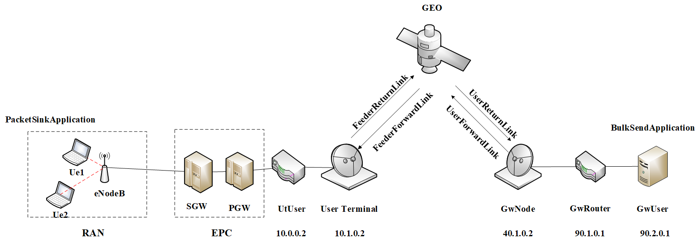

# 卫星模块导入方法
$ git clone https://github.com/sns3/sns3-data.git satellite/data
$ git clone https://forge.net4sat.org/sns3/magister-traffic.git traffic
$ git clone https://forge.net4sat.org/sns3/magister-stats.git magister-stats
$ cd ns-3.35/contrib/satellite
$ git submodule update --init --recursive

还需执行下述命令，即可运行脚本
cd ns-3.35
./waf distclean
CXXFLAGS="-wall" ./waf -d optimized --enable-examples --enable-tests --disable-python configure
./waf build -j 6

# 拓扑结构图


# 脚本存放路径：
卫星反馈链路脚本路径 -- scratch/sat-for-epc.cc
Copa的实现文件路径 -- src/internet/model/tcp-cp.cc、tcp-cp.h
PCC的实现文件路径 -- src/internet/model/tcp-pcc.cc、tcp-pcc.h

# 脚本运行方法
进入 ns-3.35 目录， 在命令行中输入:
    ./waf --run "sat-for-epc --application=？--RngRun=1 --RandomPosition=false --SatQueue=1000 --SimTime=100 --Per_enb_ue_num=2 --eNodeB_num=1"

有关命令行参数的相关说明：
1) 通过调整RngRun后跟的不同数字以获得不同的脚本运行结果
2) application处可填写 1.BulkSend(使用持续业务传输流场景)
                      2.udp (使用UDP回传服务器、客户端数据传输的场景)
                      3.http (使用3G HTTP服务器、客户端数据传输的场景)
3) 在sat-for-epc.cc文件的第890行 
    `Config::SetDefault("ns3::TcpL4Protocol::SocketType", TypeIdValue (?::GetTypeId()) ) ;`
? 可填写 TcpCp 、 TcpCubic 、 TcpPcc 、 TcpBbr
4) RandomPosition 
如果设置为 true 时 , 用户随机分布于以基站位置中心的矩形区域内;
    通过调整`Box (-3000 , 3000 , -3000 , 3000 , 1.5 , 2)`可调整矩形区域大小
如果设置为 false 时 , 用户位置固定 ;
    (```)
        Ptr<ListPositionAllocator> ue_positionAlloc = CreateObject<ListPositionAllocator> ();
        ue_positionAlloc->Add(Vector(1000,1000,1.74)) ;
        ue_positionAlloc->Add(Vector(4000 , 1000 , 1.74)) ;
    (```)
可参考上述代码增加用户位置，分别是 x , y , z 
5) SatQueue 后接的数值为 卫星UT缓冲区最大所能容纳的分组数目
6) SimTime 可以调整仿真时长，单位是秒
7) Per_enb_ue_num 可以修改每个基站服务的用户个数
8) eNodeB_num 可以调整基站的个数
